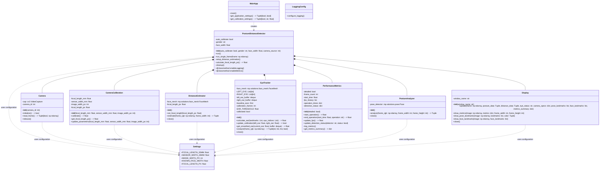

# HPB Eye Test Monitoring System - Class Diagram

```mermaid
classDiagram
    %% Main Application
    class MainApp {
        +main()
        +get_application_settings() -> Tuple[bool, bool]
        +get_calibration_settings() -> Tuple[bool, str, float]
    }

    %% PostureDistanceDetector
    class PostureDistanceDetector {
        -auto_calibrate: bool
        -gender: str
        -face_width: float
        +__init__(auto_calibrate: bool, gender: str, face_width: float, camera_source: int)
        +run()
        +run_single_frame(frame: np.ndarray)
        -setup_distance_estimation()
        -calculate_focal_length_px() -> float
        -cleanup()
        +@classmethod enableLogging()
        +@classmethod enableMetrics()
    }

    %% Models
    class Camera {
        -cap: cv2.VideoCapture
        -camera_id: int
        +__init__(camera_id: int)
        +initialize() -> bool
        +read_frame() -> Tuple[bool, np.ndarray]
        +release()
    }

    class CameraCalibration {
        -focal_length_mm: float
        -sensor_width_mm: float
        -image_width_px: int
        -focal_length_px: float
        +__init__(focal_length_mm: float, sensor_width_mm: float, image_width_px: int)
        +calibrate() -> float
        +get_focal_length_px() -> float
        +update_parameters(focal_length_mm: float, sensor_width_mm: float, image_width_px: int)
    }

    class LoggingConfig {
        +configure_logging()
    }

    class DistanceEstimator {
        -face_mesh: mp.solutions.face_mesh.FaceMesh
        -focal_length_px: float
        +__init__()
        +set_focal_length(focal_length_px: float)
        +estimate(frame_rgb: np.ndarray, frame_width: int) -> Tuple
        +close()
    }

    class EyeTracker {
        -face_mesh: mp.solutions.face_mesh.FaceMesh
        -LEFT_EYE: List[int]
        -RIGHT_EYE: List[int]
        -left_ear_buffer: deque
        -right_ear_buffer: deque
        -baseline_ears: Dict
        -calibration_frames: int
        -EAR_THRESHOLD: float
        -calibrated: bool
        +__init__()
        +calculate_ear(landmarks: List, eye_indices: List) -> float
        +update_calibration(left_ear: float, right_ear: float) -> bool
        +get_smoothed_ear(current_ear: float, buffer: deque) -> float
        +analyze(frame_rgb: np.ndarray) -> Tuple[str, list, list, bool]
        +close()
    }

    class PostureAnalyzer {
        -pose_detector: mp.solutions.pose.Pose
        +__init__()
        +analyze(frame_rgb: np.ndarray, frame_width: int, frame_height: int) -> Tuple
        +close()
    }

    class PerformanceMetrics {
        -detailed: bool
        -frame_count: int
        -start_time: float
        -fps_history: list
        -operation_times: dict
        -detection_status: dict
        +__init__(detailed: bool)
        +start_operation() -> float
        +end_operation(start_time: float, operation: str) -> float
        +update_fps() -> float
        +update_detection_status(detector: str, status: bool)
        +log_metrics()
        +get_metrics_summary() -> dict
    }

    %% Views
    class Display {
        -window_name: str
        +__init__(window_name: str)
        +update(frame: np.ndarray, posture_data: Tuple, distance_data: Tuple, eye_status: str, camera_specs: dict, pose_landmarks: list, face_landmarks: list, metrics_summary: dict)
        +draw_metrics(image: np.ndarray, metrics: dict, frame_width: int, frame_height: int)
        +draw_pose_landmarks(image: np.ndarray, landmarks: list, color: Tuple)
        +draw_face_landmarks(image: np.ndarray, face_landmarks: list)
        +close()
    }

    %% Configuration
    class Settings {
        +FOCAL_LENGTH_35MM: float
        +SENSOR_WIDTH_35MM: float
        +IMAGE_WIDTH_PX: int
        +KNOWN_FACE_WIDTH: float
        +FOCAL_LENGTH_PX: float
    }

    %% Class Relationships
    MainApp ..> PostureDistanceDetector : creates
    PostureDistanceDetector *-- Camera
    PostureDistanceDetector *-- CameraCalibration
    PostureDistanceDetector *-- DistanceEstimator
    PostureDistanceDetector *-- EyeTracker
    PostureDistanceDetector *-- PostureAnalyzer
    PostureDistanceDetector *-- Display
    PostureDistanceDetector *-- PerformanceMetrics
    PostureDistanceDetector ..> Settings : uses configuration
    Camera ..> Settings : uses configuration
    CameraCalibration ..> Settings : uses configuration
    DistanceEstimator ..> Settings : uses configuration
    EyeTracker ..> Settings : uses configuration
    PostureAnalyzer ..> Settings : uses configuration
    Display ..> Settings : uses configuration
```
